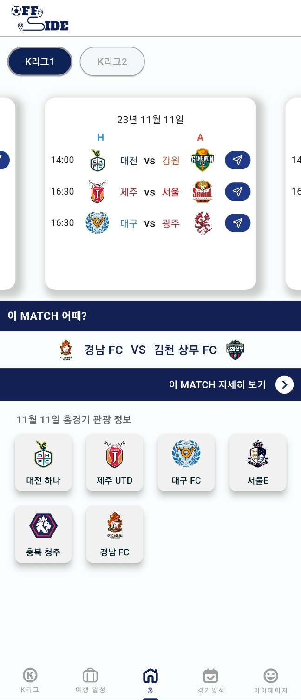

# OFFSIDE
K-League Tourism Application
2023년도 관광데이터 활용 공모전 Tour API4.0 우수상 수상작 OFFSIDE
주관 : 한국관광공사 & Kakao

### 팀장
- 조민수 : 충북대학교 소프트웨어학과 18학번
### 팀원
- 김광모 : 충북대학교 소프트웨어학과 18학번
- 서종원 : 충북대학교 소프트웨어학과 18학번
- 정채린 : 충북대학교 소프트웨어학과 20학번
- 강희주 : 충북대학교 소프트웨어학과 22학번

#

### Project 의의
K리그 팬들에게 K리그1, 2 경기 관련 정보 제공 및 직관러들에게 직관에서 끝나지 않고 여행까지 이어질 수 있는 여행지 추천 및 관리 Application

### Project 기능
  - K리그1, 2 소속 팀 정보
  - 리그 경기 일정 및 결과 / 응원 팀 일정 및 결과 정보
  - 응원 팀 팬 커뮤니티 기능
  - 각 팀 홈구장 주변 맛집 / 카페 / 여행지 등 관광정보 추천
  - 경기 직관 전/후의 여행일정 생성 및 관리

### 개발 기술 스택 및 사용 API
  - Dart / Flutter
  - Figma
  - JIRA
  - Git
  - Firebase
  - Tour API 4.0  (공공데이터 포텉 - 국문관광정보 데이터)
  - Kakao Login API
  - Kakao MAP API
  - Kakao Navigation API

### Application Link
[OFFSIDE](https://play.google.com/store/apps/details?id=com.OFFSIDE.offside)

## Project 결과화면

### AWARDS

